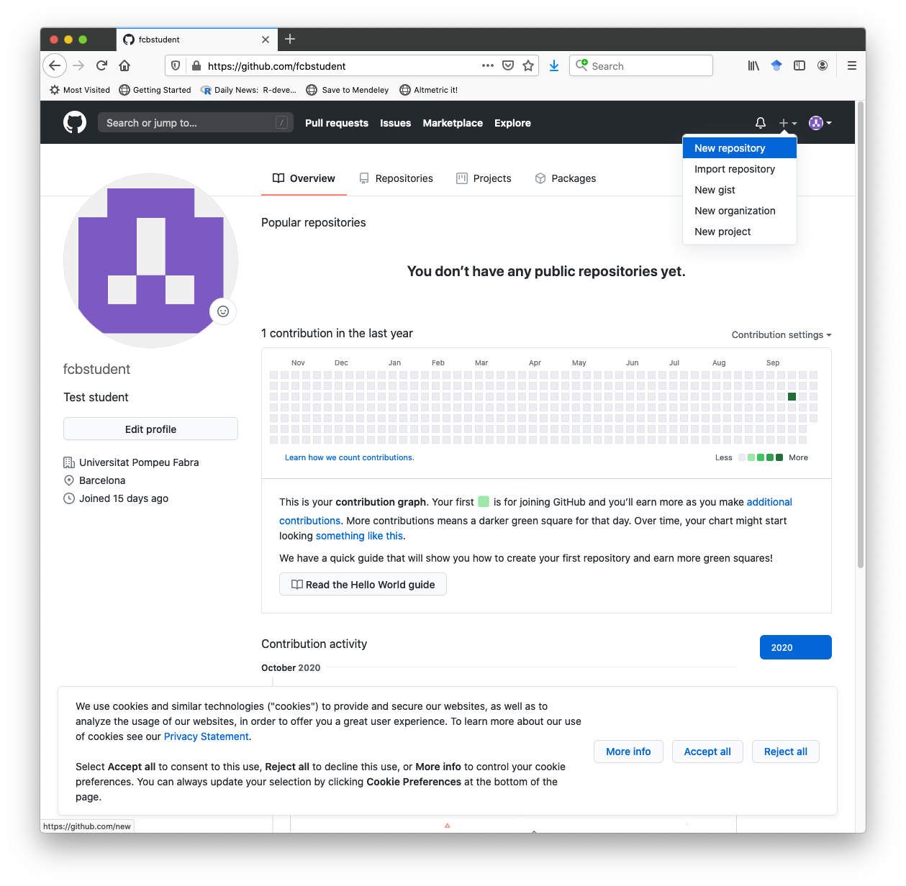

# Objectives

The learning objectives for this practical are:

 * Setting up Git
 * Setting up a Git repo in our local disk.
 * Update your local repository.
 * Upload your local repository to GitHub.

# Setup and background

We will download again some COVID19 data. Please follow the next two steps:

1. Go to the Catalan Health Departament COVID data portal at [https://dadescovid.cat](https://dadescovid.cat)
   and switch the language to "ENGLISH" using the pull-down menu on the top-right corner of the page.
2. Follow the downloads link and on the next page click and download the two
   files corresponding to the "7 DAY AGGREGATION" for "CATALUNYA" and "COUNTIES"
   ("COMARQUES" in Catalan). It is important that you download both files in the
   same day to make them comparable, because all data is updated daily. Make sure you know
   exactly where in your filesystem these two files have been downloaded.
   **Tip:** some browsers automatically download files into a folder called "Downloads"
   or under a name corresponding to the translation of "Downloads" to the default
   language of your operating system.
3. Make a directory in your filesystem, for instance at your _home_ directory,
   called `practical3` and copy in it the CSV files contained in the previous two
   ZIP files that you have downloaded, as you analogously did in practical 1 and 2.

# Setting up Git

We start setting up some global options for Git. You only need to do this once in your
computer. Make sure you have git installed in your system by opening the Unix shell and typing:
```
$ which git
```
If you get no answer from this command, it means that you need to install the Git software.
Check out the [setup](/setup/) page for instructions about how to install it. Once git is
installed, please verify the version of git you have by typing:

```
$ git --version
```
Now you should set up your identity with Git by giving your name and email address. This
information is important because Git will store it in every commit and will allow you and
others to track which changes you have made. To set up your identity type:

```
$ git config --global user.name "XXXXX YYYY"
$ git config --global user.email "ZZZZ@WWWW.UUUU"
```
where `XXXXX` is your first name and `YYYYY` is your family name, while
`ZZZZ@WWWW.UUUU` if you student UPF email address.

It may be handy to set up your favorite text editor associated with Git, so that when
Git requires you to write some text, your favorite text editor is launched. Please check
the following [link](https://docs.github.com/en/free-pro-team@latest/github/using-git/associating-text-editors-with-git) to find out how to set your favorite text editor associated with Git. If you don't
set up any text editor, it's likely that, when Git needs it, it will start a classical
text editor, such as Vi or Emacs. In the case of Vi, to write you need first to press the
key of letter 'i' and then you can type your text. Once you're finished, press Esc, colon (:) and
type 'x' for save and quit.

To verify that you have set up your global configuration data correctly, please type:

```
$ git config -l
```

Git has built-in documentation that you can access in different ways:

```
$ git help
$ git help command
$ git command --help
```
where `command` is one of Git's commands such as `add` or `checkout`.

# Setting up a Git repo in our local disk

Here we are going to set up our first Git repo in our local disk. First make sure you have
a directory called `practical3` with the two CSV files `cataluna_setmanal.csv' and
'comarques_setmanal.csv'. Now, enter the `practical3` directory and type the following:

```
$ git init
```
Verify that the `.git` database directory has been created by typing (you should see a
directory called `.git/` next to your CSV files):

```
$ ls -lhaF
drwxr-xr-x  5 robert  staff   160B Oct  7 17:49 ./
drwxr-xr-x  7 robert  staff   224B Oct  7 17:49 ../
drwxr-xr-x  9 robert  staff   288B Oct  7 17:49 .git/
-rw-r--r--@ 1 robert  staff   1.4M Oct  7 17:49 comarques_setmanal.csv
-rw-r--r--  1 robert  staff   800K Oct  7 17:49 comarques_setmanal_general.csv
```

Checkout the status of your Git repo using `git status`:

```
$ git status
On branch master

No commits yet

Untracked files:
  (use "git add <file>..." to include in what will be committed)
	comarques_setmanal.csv
	comarques_setmanal_general.csv

nothing added to commit but untracked files present (use "git add" to track)
```

You should note that we have two modified files that are "untracked" (unstaged).
Stage those files by using the `git add` command and check the status again:

```
$ git add .
$ git status
On branch master

No commits yet

Changes to be committed:
  (use "git rm --cached <file>..." to unstage)
	new file:   comarques_setmanal.csv
	new file:   comarques_setmanal_general.csv
```

Finally, commit the staged files by doing:

```
$ git commit -m 'First commit.'
[master (root-commit) d35b756] First commit.
 2 files changed, 26965 insertions(+)
 create mode 100644 comarques_setmanal.csv
 create mode 100644 comarques_setmanal_general.csv
```

Check out that the status doesn't have pending commits anymore:

```
$ git status
On branch master
nothing to commit, working tree clean
```

Examine this first change with `git log`:

```
$ git log
commit d35b7567e8ddef0534303737e0b8b3a51b4c0ec6 (HEAD -> master)
Author: Robert Castelo <robert.castelo@upf.edu>
Date:   Thu Oct 7 17:55:50 2020 +0200

    First commit.
```

# Update your local repository

Here we want to practise how to update the local repository, keeping track of the
changes with Git. First, create a file called `catalunya_setmanal_geriatric.csv`
with the subset of the data in `catalunay_setmanal.csv` corresponding to the
population that lives in geriatric residences (see practical 2). Once you have
generated that file, check out the status of the repo. You should notice that
Git has detected a new file that is untracked. Stage this untracked file and
commit the change to the repo.

# Upload your local repository to GitHub

Here we want to create in GitHub a remote repository connected to our local one.
Log into your GitHub account. Click on the plus sign on the top-right and select
"New repository" from the pull-down menu.



In the next page, type `practical3` in the textbox under `Repository name`, select
`Private` for the type of repository and press the button `Create repository`.


At this point you have created in your GitHub account an empty repository called
`practical3`. We are going to connect it now with our local repository of
`practical3`. Make sure your CWD is the Git repository `practical3` in your local disk
and follow the instructions in the GitHub page under the title **"... or push an existing
repository from the command line"**, by typing:

```
$ git remote add origin https://github.com/fcbstudent/practical3.git
$ git branch -M main
$ git push -u origin main
Enumerating objects: 4, done.
Counting objects: 100% (4/4), done.
Delta compression using up to 4 threads
Compressing objects: 100% (4/4), done.
Writing objects: 100% (4/4), 368.54 KiB | 4.24 MiB/s, done.
Total 4 (delta 1), reused 0 (delta 0)
remote: Resolving deltas: 100% (1/1), done.
To https://github.com/fcbstudent/practical3.git
 * [new branch]      main -> main
Branch 'main' set up to track remote branch 'main' from 'origin'.
```

Click now on the link to the private repo on the top-left of your GitHub account
to go to the page of the repo and check that the files have been successfully
uploaded to GitHub.


Check out also that the status of your local repo tells that it is up to date
with the new remote connection.

```
$ git status
On branch main
Your branch is up to date with 'origin/main'.

nothing to commit, working tree clean
```

The GitHub page for the repo has several tabs, where the one called "Settings"
can be used to configure some of the other tabs and perform actions such as
switching the visibility from private to public or delete entirely this repository
from GitHub.
