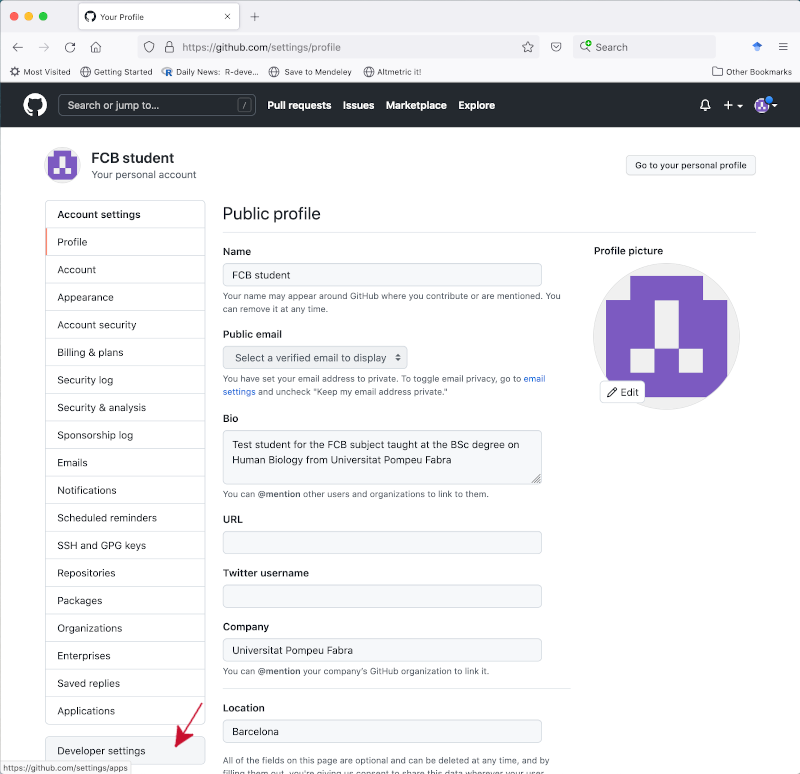
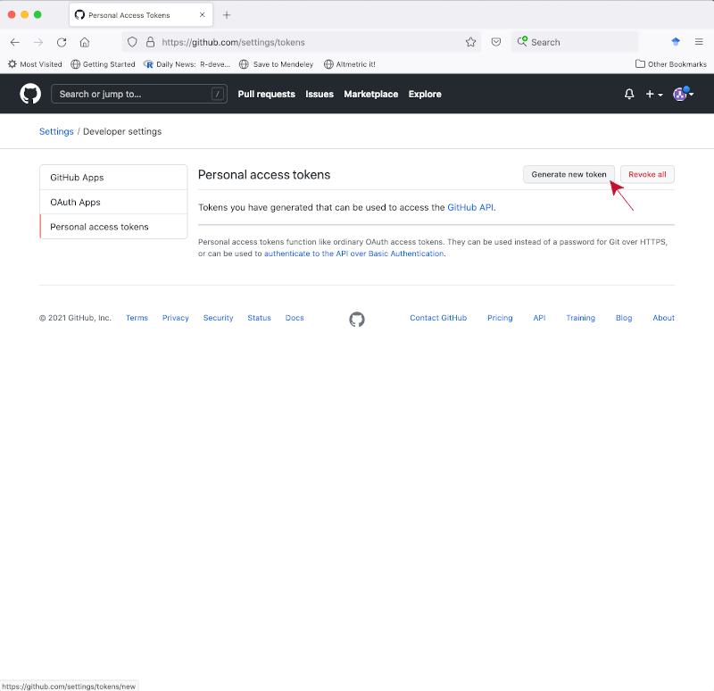
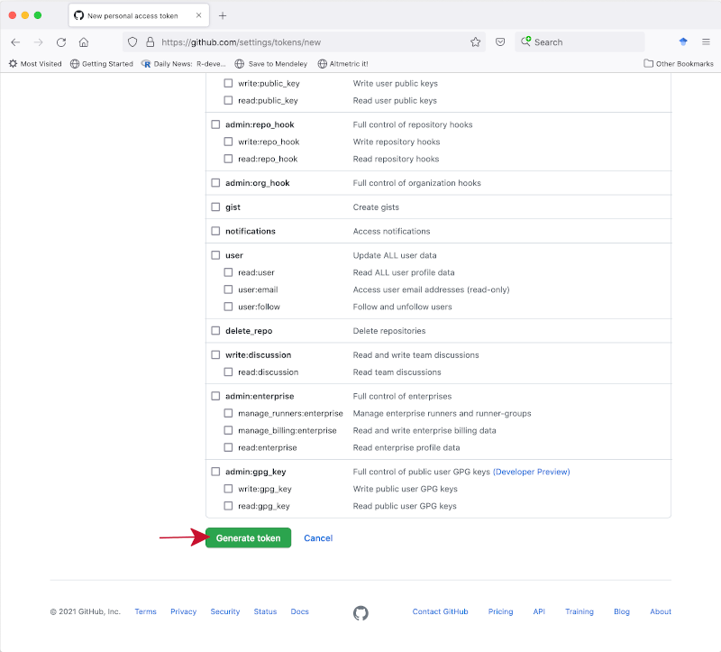

# Objectives

The learning objectives for this practical are:

 * Have your computer set up to work with the Unix command-line.
 * Download epidemiological data from the Catalan SIVIC network.
 * Setting up Git.
 * Setting up a personal access token in GitHub.
 * Setting up a Git repo in your local disk.
 * Update your local Git repo.
 * Upload your local Git repo to GitHub.
 * Cloning a GitHub repo into a local Git repo.
 * Push changes to GitHub.
 * Pull changes from GitHub.
 * Undo changes in your local Git repo.

# Setup and background

In this practical we will learn to use the Git version control system (VCS).
You need to have access to a Unix
[command-line interface (CLI)](https://en.wikipedia.org/wiki/Command-line_interface)
and to the Git VCS software. If you are doing this practical in your own
computer, please check the [setup](/setup/) webpage to make sure that you have
access to some flavor of a Unix operating system, its CLI and the Git VCS.

We will use the data files called `mostres_analitzades.csv` i
`virus_detectats.csv` that were generated in the
[first practical](/practical1/). If you don't have these files, please review
that practical and generate them again. Once you have obtained those two files,
copy them into a fresh new directory called `practical3`.

# Setting up Git

We start setting up some global options for Git. You only need to do this once
in your computer. Make sure you have Git installed in your system by opening
the Unix shell and typing:
```
$ git --version
```
If you get no answer from this command, it means that you need to install the
Git software. Check out the [setup](/setup/) page for instructions about how to
install it. Once Git is installed, the previous command should give you the
installed version of the Git software.

Now you should set up your identity with Git by giving your name and email
address. This information is important because Git will store it in every
commit and will allow you and others to track which changes you have made. To
set up your identity type:

```
$ git config --global user.name "XXXXX YYYY"
$ git config --global user.email "ZZZZ@WWWW.UUUU"
```
where `XXXXX` is your first name and `YYYYY` is your family name, while
`ZZZZ@WWWW.UUUU` if you student UPF email address. Another handy option is to
tell Git to store your GitHub credentials into a hidden file
`~/.git-credentials` to avoid having to enter them each time you do an operation
that requires them, such as _pushing_ your changes to a remote GitHub repo. To
set up that option type on the shell

```
$ git config --global credential.helper store
```

It may be handy to set up your favorite text editor associated with Git, so that when
Git requires you to write some text, your favorite text editor is launched. Please check
the following [link](https://docs.github.com/en/free-pro-team@latest/github/using-git/associating-text-editors-with-git) to find out how to set your favorite text editor associated with Git. If you don't
set up any text editor, it's likely that, when Git needs it, it will start a classical
text editor, such as Vi or Emacs. In the case of Vi, to write you need first to press the
key of letter 'i' and then you can type your text. Once you're finished, press Esc, colon (:) and
type 'x' for save and quit.

To verify that you have set up your global configuration data correctly, please type:

```
$ git config -l
```

Git has built-in documentation that you can access in different ways:

```
$ git help
$ git help command
$ git command --help
```
where `command` is one of Git's commands such as `add` or `checkout`.

# Setting up a personal access token in GitHub

Since August 2021, GitHub has raised their security standards by separating the
way in which we authenticate ourselves with a username and a password into our
GitHub profile at [https://github.com](https://github.com), from the way in which
we authenticate ourselves to perform Git operations from the Unix command line
that affect a remote repo in [https://github.com](https://github.com); see this
[blog post](https://github.blog/2020-12-15-token-authentication-requirements-for-git-operations)
if you want to have an intuition about GitHub acces tokens and this
[page](https://docs.github.com/en/authentication/keeping-your-account-and-data-secure/managing-your-personal-access-tokens)
for full details on how to generate them.

In summary, in both situations we should use the same username, but with
**different** passwords. **For accessing our GitHub profile** at
[https://github.com](https://github.com) we will use the password we set when
we created our profile, while **for performing Git operations from the Unix
command line that affect a remote repo** in [https://github.com](https://github.com)
we need to generate another one, which GitHub calls a
[personal access token](https://docs.github.com/en/authentication/keeping-your-account-and-data-secure/creating-a-personal-access-token),
with the following steps:

1. Log into your GitHub profile at [https://github.com](https://github.com) and
  go to the `Settings` option from the pull-down menu of your profile.

    

2. Click on the `Developer settings` tab located on the left-side menu panel.

    

3. Click on the `Personal access token` tab located on the left-side menu panel.

    

4. Click on the `Generate new token` button.

    

5. In the form for generating a new personal access token enter `fcb` on the `Note`
  field, set the `Expiration` pull-down menu to `No expiration` and select the
  checkbox `repo` among the `Select scopes` options.

    

6. Click on the button `Generate token` at the bottom of the page.

    

7. In the new page showing the personal access token, click on the copy icon,
  or select and copy the token yourself, and store it securely somewhere in your
  local disk. **This is the password you will have to use** when you perform Git
  operations from the Unix command line that affect a remote repo in
  [https://github.com](https://github.com), such as the ones we will see in
  sections
  [Upload your local Git repo to GitHub](#upload-your-local-git-repo-to-github),
  [Cloning a GitHub repo into a local Git repo](#cloning-a-github-repo-into-a-local-git-repo),
  [Push changes to GitHub](#push-changes-to-github) and
  [Pull changes from GitHub](#pull-changes-from-github).

    

# Setting up a Git repo in your local disk

Here we are going to set up our first Git repository, commonly referred to with
the shorthand Git _repo_, in our local disk. First make sure you have a
directory called `practical3` with the two CSV files `mostres_analitzades.csv`
and `virus_detectats.csv`. Now, enter the `practical3` directory and type
the following:

```
$ git init
```
Verify that the `.git` database directory has been created by typing (you should see a
directory called `.git/` next to your CSV files):

```
$ ls -lhaF
total 4864
drwxr-xr-x    5 robert  staff   160B Oct  6 18:51 ./
drwxr-xr-x+ 115 robert  staff   3.6K Oct  6 18:49 ../
drwxr-xr-x    9 robert  staff   288B Oct  6 18:51 .git/
-rw-r--r--@   1 robert  staff   1.2M Oct  6 18:51 mostres_analitzades.csv
-rw-r--r--@   1 robert  staff   1.2M Oct  6 18:51 virus_detectats.csv
```

Checkout the status of your Git repo using `git status`:

```
$ git status
On branch main

No commits yet

Untracked files:
  (use "git add <file>..." to include in what will be committed)
	mostres_analitzades.csv
	virus_detectats.csv

nothing added to commit but untracked files present (use "git add" to track)
```

You should note that we have two modified files that are "untracked" (unstaged).
Stage those files by using the `git add` command and check the status again:

```
$ git add .
$ git status
On branch main

No commits yet

Changes to be committed:
  (use "git rm --cached <file>..." to unstage)
        new file:   mostres_analitzades.csv
        new file:   virus_detectats.csv
```

Finally, commit the staged files by doing:

```
$ git commit -m 'First commit.'
[main (root-commit) 3a7b39e] First commit
 2 files changed, 28448 insertions(+)
 create mode 100644 mostres_analitzades.csv
 create mode 100644 virus_detectats.csv
```

Check out that the status doesn't have pending commits anymore:

```
$ git status
On branch main
nothing to commit, working tree clean
```

Examine this first change with `git log`:

```
$ git log
commit 3a7b39e619809318a9076e38033ba226ccd60e80 (HEAD -> main)
Author: Robert Castelo <robert.castelo@upf.edu>
Date:   Fri Oct 6 18:55:51 2023 +0200

    First commit
```

# Update your local Git repo

Here we want to practise how to update the local Git repo, keeping track of the
changes with Git. First, create a file called `mostres_analitzades_bcn.csv`
with the subset of the data in `mostres_analitzades.csv` corresponding to the
rows derived from the area of Barcelona (see [practical 2](/practical2/)). Once
you have generated that file, check out the status of the repo. You should
notice that Git has detected a new file that is untracked. Stage this untracked
file and commit the change to the repo.

# Upload your local Git repo to GitHub

Here we want to create in GitHub a remote Git repo connected to our local one.
We illustrate such process using the previous local Git repo.

To get started, log into your GitHub account, click on the plus sign on the
top-right and select "New repository" from the pull-down menu.


In the next page, type `practical3` in the textbox under `Repository name`, select
`Private` for the type of repository and press the button `Create repository`.


At this point you have created in your GitHub account an empty Git repo called
`practical3`. We are going to connect it now with our local Git repo of
`practical3`. Make sure your CWD is the Git repo `practical3` in your local disk
and follow the instructions in the GitHub page under the title
**"... or push an existing repository from the command line"**. They consist of
the following three steps:

  1. Create a new connection to your remote GitHub repo with `git remote add`,
    **REPLACING** the `fcbstudent` word below **BY YOUR OWN USERNAME**):

        ```
        $ git remote add origin https://github.com/fcbstudent/practical3.git
        ```
   You can check whether this connection has been successfully established by
   using the `-v` option with the `remote` command:

        ```
        $ git remote -v
        origin	https://github.com/fcbstudent/practical3.git (fetch)
        origin	https://github.com/fcbstudent/practical3.git (push)
        ```
   If you see **no** URL connection specified to the right of the word `origin`
   or if the connection you see is to the `fcbstudent` user instead of your own,
   then you have misspecified the repo URL. Before you try again to add
   the correct remote connection, you should remove this _bogus_ one by typing:

        ```
        $ git remote remove origin
        ```

  2. Create the default branch under the name `main`:

        ``` 
        $ git branch -M main
        ```

  3. Push the contents of the current branch in the local Git repo to the
    upstream main branch in the GitHub repo:

        ```
        $ git push -u origin main
        Enumerating objects: 7, done.
        Counting objects: 100% (7/7), done.
        Delta compression using up to 8 threads
        Compressing objects: 100% (7/7), done.
        Writing objects: 100% (7/7), 220.04 KiB | 2.62 MiB/s, done.
        Total 7 (delta 3), reused 0 (delta 0), pack-reused 0
        remote: Resolving deltas: 100% (3/3), done.
        To https://github.com/fcbstudent/practical3.git
         * [new branch]      main -> main
        branch 'main' set up to track 'origin/main'.
        ```
   In this step you may be asked for your GitHub username and a password.
   **Warning**: the password that you enter here to perform this Git operation
   on a remote repository **is not** the one you use to enter into your GitHub
   profile, but it should be a _personal access token_ that you have previously
   generated (see the previous instructions on section
   [Setting up a personal access token in GitHub](#setting-up-a-personal-access-token-in-github)).
   If you enter the wrong password then, instead of the previous output, you will get the
   following error:

        ```
        remote: Support for password authentication was removed on August 13, 2021.
        Please use a personal access token instead.
        remote: Please see https://github.blog/2020-12-15-token-authentication-requirements-for-git-operations/ for more information
        fatal: Authentication failed for 'https://github.com/fcbstudent/practical3.git/'
        ```
   In such a case, you should either try again with your _personal access token_
   or, if you have not generate it yet, then go to the previous instructions on
   [Setting up a personal access token in GitHub](#setting-up-a-personal-access-token-in-github)).
   and follow the steps to generate a _personal access token_ for GitHub. If you
   think you are using the correct _personal access token_, but you still get an
   error, then probably the connection to the remote GitHub repo has not been
   correctly established. In such a case, go back to step 1, use the given
   command to remove this current connection and try to add it again, making
   sure that the GitHub URL is correct.

Click now on the link to the private repo on the top-left of your GitHub account
(`yourgithubusername/practical3`) to go to the page of the repo and check that
the files have been successfully uploaded to GitHub.


Check out also that the status of your local repo tells that it is up to date
with the new remote connection.

```
$ git status
On branch main
Your branch is up to date with 'origin/main'.

nothing to commit, working tree clean
```

The GitHub page for the repo has several tabs, where the one called "Settings"
can be used to configure some of the other tabs and perform actions such as
switching the visibility from private to public or delete entirely this Git
repo from GitHub.

# Cloning a GitHub repo into a local Git repo

The reverse operation of uploading a local repo to a GitHub is **cloning**
a GitHub repo into a local repo. When you _clone_ a GitHub repo, you are copying
into your local filesystem all the files, version history and branches from the
GitHub repo.

To _clone_ a GitHub repo into your local filesystem you use the Git command
`clone` as follows:
```
$ git clone https://github.com/USERNAME/REPONAME [DIRECTORY]
```
where `USERNAME` is the username owner of the repo you want to _clone_, while
`REPONAME` is the name of the Git repo you want to clone. **Optionally**, you can
give a directory name in `DIRECTORY` to clone the repo under a directory called
differently to the `REPONAME`.

For instance, go to your home directory and clone your recently created GitHub
repo `practical3` into a different name such as `practical3copy` by doing:

```
$ cd
$ git clone https://github.com/USERNAME/practical3 practical3copy
```
where you should replace `USERNAME` by your username. The system will ask you
for your usename and password, where you should copy and paste your GitHub
access token as a password.

# Push changes to GitHub 

Here, we are going to see how update the new local copy of our remote GitHub repo
and send (_push_ in Git terminology) those changes to the remote GitHub repo.
Enter in the directory of this new local copy of the GitHub repo and introduce a
change by creating a `README.md` file using a Unix shell terminal output redirection
as follows:

```
$ cd practical3copy
$ cat > README.md
This is Practical 3!
```
Remember to press the keys `Ctrl+d` once you've typed the text. Now list the files,
verify that a new file called `README.md` is there, that it has the contents you've
typed and check the status of the repo:

```
$ ls
README.md                   mostres_analitzades_bcn.csv
mostres_analitzades.csv     virus_detectats.csv
$ cat README.md 
This is Practical 3!
$ git status
On branch main
Your branch is up to date with 'origin/main'.

Untracked files:
  (use "git add <file>..." to include in what will be committed)
        README.md

nothing added to commit but untracked files present (use "git add" to track)
```
Stage the modified files and check the status again:
```
$ git add .
$ git status
On branch main
Your branch is up to date with 'origin/main'.

Changes to be committed:
  (use "git restore --staged <file>..." to unstage)
        new file:   README.md
```
Commit the staged files and check the status again:
```
$ git commit -m 'Added README.md'
[main 64b8488] Added README.md
 1 file changed, 1 insertion(+)
 create mode 100644 README.md
$ git status
On branch main
Your branch is ahead of 'origin/main' by 1 commit.
  (use "git push" to publish your local commits)

nothing to commit, working tree clean
```
Finally, push the changes to the remote GitHub repo:
```
$ git push
Enumerating objects: 4, done.
Counting objects: 100% (4/4), done.
Delta compression using up to 8 threads
Compressing objects: 100% (2/2), done.
Writing objects: 100% (3/3), 299 bytes | 299.00 KiB/s, done.
Total 3 (delta 1), reused 0 (delta 0), pack-reused 0
remote: Resolving deltas: 100% (1/1), completed with 1 local object.
To https://github.com/fcbstudent/practical3
   0cd8cf9..64b8488  main -> main
```
If this last step has been successful, you should be able to see the
new file after reloading the webpage of GitHub, and actually its contents as
shown here below (a `README.md` file at the root of a GitHub repo has a special
[treatment](https://docs.github.com/en/free-pro-team@latest/github/creating-cloning-and-archiving-repositories/about-readmes)
in the GitHub page of the repo).


# Pull changes from GitHub 

You have your initial copy of the GitHub repo at `~/practical3` and
a modified copy at `~/practical3copy`, where the latter has been
synchronized with the remote GitHub repo. Now, let's see how could
we update (_pull_ in Git terminology) our initial copy with the
latest changes made in the second copy of our repo. First enter
the directory of the initial copy of the GitHub repo (here we assume
it was created at the _home_ directory) and verify it lacks the
last file `README.md` we have added to the GitHub repo:

```
$ cd
$ cd practical3
$ ls
mostres_analitzades.csv     virus_detectats.csv
mostres_analitzades_bcn.csv
```
Second, _pull_ the changes from GitHub and verify the new file
`README.md` has been added to this copy of the GitHub repo:
```
$ git pull
remote: Enumerating objects: 4, done.
remote: Counting objects: 100% (4/4), done.
remote: Compressing objects: 100% (1/1), done.
remote: Total 3 (delta 1), reused 3 (delta 1), pack-reused 0
Unpacking objects: 100% (3/3), 279 bytes | 93.00 KiB/s, done.
From https://github.com/fcbstudent/practical3
   0cd8cf9..64b8488  main       -> origin/main
Updating 0cd8cf9..64b8488
Fast-forward
 README.md | 1 +
 1 file changed, 1 insertion(+)
 create mode 100644 README.md
$ ls
README.md                   mostres_analitzades_bcn.csv
mostres_analitzades.csv     virus_detectats.csv
```

In general, you will not work with two local copies of the same
GitHub repo in the same computer. **We have used these two copies here
only to illustrate** how to _clone_ a remote repo, and _push_ and _pull_
changes from that repo. The main utility of these actions is when
either you work in two or more computers and need to synchronize your
local copies of the GitHub repo, or you are working with collaborators
that all update the same GitHub repo.

# Undo changes in your local Git repo

One of the great things about working with a version-control system is the
ability to undo changes, reverting to some previous state of your files. This
functionality, however, only applies to changes that have been staged and
committed to the Git database. For this reason, it is important and useful to
commit your changes often. Depending on the kind change you want to undo, the
command to undo that change will be different. Here we cover a few cases:

* **Restore a deleted file.** There are several options depending on the
  moment in which you deleted the file:

  1. The file was deleted before or after the deletion was staged, but
    the deletion was not commited to the Git database. We illustrate here
    this case by removing the file `mostres_analitzades.csv` and immediately
    restoring it again:

        ```
        $ rm mostres_analitzades.csv
        $ ls
        README.md                   virus_detectats.csv
        mostres_analitzades_bcn.csv
        $ git status
        On branch main
        Your branch is up to date with 'origin/main'.

        Changes not staged for commit:
          (use "git add/rm <file>..." to update what will be committed)
          (use "git restore <file>..." to discard changes in working directory)
          deleted:    mostres_analitzades.csv

        no changes added to commit (use "git add" and/or "git commit -a")

        $ git checkout HEAD mostres_analitzades.csv ## <-- RESTORING GIT COMMAND
        Updated 1 path from 7b1b617
        $ ls
        README.md                   mostres_analitzades_bcn.csv
        mostres_analitzades.csv     virus_detectats.csv
        ```

  2. After the file was deleted, that deletion was staged and commited
    to the Git database and no other commits were introduced. Let's illustrate
    it again removing the file `mostres_analitzades.csv`, but this time staging
    and commiting that change:

        ```
        $ rm mostres_analitzades.csv
        $ git add .
        $ git commit -m 'Removed mostres_analitzades.csv'
        [main 7946ebf] Removed mostres_analitzades.csv
         1 file changed, 14613 deletions(-)
         delete mode 100644 mostres_analitzades.csv
        $ ls
        README.md                   virus_detectats.csv
        mostres_analitzades_bcn.csv
        $ git status
        On branch main
        Your branch is ahead of 'origin/main' by 1 commit.
          (use "git push" to publish your local commits)

        nothing to commit, working tree clean
        $ git reset HEAD~1                         ## <-- RESTORING GIT COMMAND
        Unstaged changes after reset:
        D       mostres_analitzades.csv
        $ git status
        On branch main
        Changes not staged for commit:
          (use "git add/rm <file>..." to update what will be committed)
          (use "git restore <file>..." to discard changes in working directory)
          deleted:          mostres_analitzades.csv 

        no changes added to commit (use "git add" and/or "git commit -a")
        ```
    The Git command `git reset HEAD~1` reverts the deletion commit leaving it
    as an unstaged change and therefore, you should still apply the previous
    option 1 above to recover the file:

        ```
        $ git checkout HEAD mostres_analitzades.csv ## <-- RESTORING GIT COMMAND
        Updated 1 path from 7b1b617
        $ ls
        README.md                   mostres_analitzades_bcn.csv
        mostres_analitzades.csv     virus_detectats.csv
        ```


  3. After the file was deleted, that deletion was staged and commited
    to the Git database and afterwards other commits were also introduced.
    Let's illustrate it again removing the file `mostres_analitzades.csv`, but
    this time staging and commiting that change and staging and commiting
    one further change:

        ```
        $ rm mostres_analitzades.csv
        $ git add .
        $ git commit -m 'Removed mostres_analitzades.csv'
        [main 588acf0] Removed mostres_analitzades.csv
         1 file changed, 14613 deletions(-)
         delete mode 100644 mostres_analitzades.csv
        $ ls
        README.md                   virus_detectats.csv
        mostres_analitzades_bcn.csv
        $ git status
        On branch main
        Your branch is ahead of 'origin/main' by 1 commit.
          (use "git push" to publish your local commits)

        nothing to commit, working tree clean
        $ head virus_detectats.csv > virus_detectats_head.csv
        $ ls
        README.md                   virus_detectats.csv
        mostres_analitzades_bcn.csv virus_detectats_head.csv
        $ git add .
        $ git commit -m 'Added virus_detectats_head.csv'
        [main cdc101b] Added virus_detectats_head.csv
         1 file changed, 10 insertions(+)
         create mode 100644 virus_detectats_head.csv
        ```
    At this point we should look up the
    [_commit hash_](https://git-scm.com/book/en/v2/Git-Tools-Revision-Selection)
    of the change that removed the file, using the command
    `git log -- removedfilename`:

        ```
        $ git log -- mostres_analitzades.csv
        commit 588acf0ecace42d0b53cb00b71bcc500f3fd4aba
        Author: Robert Castelo <robert.castelo@upf.edu>
        Date:   Fri Oct 6 19:36:46 2023 +0200

            Removed mostres_analitzades.csv

        commit 3a7b39e619809318a9076e38033ba226ccd60e80
        Author: Robert Castelo <robert.castelo@upf.edu>
        Date:   Fri Oct 6 18:55:51 2023 +0200

            First commit
        ```
    Then, check out the file from the commit before the one that deleted it
    using the command `git checkout commithash~1 -- removedfilename`:

        ```
        $ git checkout checkout 588acf0ecace42d0b53cb00b71bcc500f3fd4aba~1 -- mostres_analitzades.csv
        $ ls
        README.md                   virus_detectats.csv
        mostres_analitzades.csv     virus_detectats_head.csv
        mostres_analitzades_bcn.csv
        ```
    Here the characters `~1` at the end of the commit hash indicate Git to
    go exactly one commit before the given commit hash. Finally, you should
    stage and commit the recovered file since it will appear to Git as a new
    file:

        ```
        $ git status
        On branch main
        Changes to be committed:
          (use "git restore --staged <file>..." to unstage)
                new file:   mostres_analitzades.csv

        $ git add .
        $ git commit -m 'Added back mostres_analitzades.csv'
        [main 85448e7] Added back mostres_analitzades.csv
         1 file changed, 14613 insertions(+)
         create mode 100644 mostres_analitzades.csv
        $ git status
        On branch main
        Your branch is ahead of 'origin/main' by 3 commits.
          (use "git push" to publish your local commits)

        nothing to commit, working tree clean
        ```
    In this example we have a copy of our repo in GitHub, and for that reason
    the status command keeps tellings us that our local copy has 3 commits that
    are not yet synchronized with the remote repo (_Your branch is ahead of
    'origin/main' by 3 commits_). We can synchronize these 3 commits with the
    remote repo by doing _git push_:

        ```
        $ git push
        Enumerating objects: 8, done.
        Counting objects: 100% (8/8), done.
        Delta compression using up to 8 threads
        Compressing objects: 100% (7/7), done.
        Writing objects: 100% (7/7), 1.01 KiB | 1.01 MiB/s, done.
        Total 7 (delta 3), reused 0 (delta 0), pack-reused 0
        remote: Resolving deltas: 100% (3/3), completed with 1 local object.
        To https://github.com/fcbstudent/practical3.git
           64b8488..85448e7  main -> main
        $ git status
        On branch main
        Your branch is up to date with 'origin/main'.
        nothing to commit, working tree clean
        ```

    If you examine the whole history of this example, you should find
    the commits corresponding to the deletion, the addition of a new file
    and the recovery of the deleted file:

        ```
        $ git log
        commit 85448e7f651826dc33cee9b40b8f68e57f547bd5 (HEAD -> main)
        Author: Robert Castelo <robert.castelo@upf.edu>
        Date:   Fri Oct 6 19:47:08 2023 +0200

            Added back mostres_analitzades.csv

        commit cdc101bb0c70a2468832af30b2290918e59f4bb5
        Author: Robert Castelo <robert.castelo@upf.edu>
        Date:   Fri Oct 6 19:40:10 2023 +0200

            Added virus_detectats_head.csv

        commit 588acf0ecace42d0b53cb00b71bcc500f3fd4aba
        Author: Robert Castelo <robert.castelo@upf.edu>
        Date:   Fri Oct 6 19:36:46 2023 +0200

            Removed mostres_analitzades.csv

        commit 64b8488694d676dbe785b8e54dc17e3ec60bd07e (origin/main)
        Author: Robert Castelo <robert.castelo@upf.edu>
        Date:   Fri Oct 6 19:22:38 2023 +0200

            Added README.md

        commit 0cd8cf9186004455bd548a7b91f5c20604be6ea9
        Author: Robert Castelo <robert.castelo@upf.edu>
        Date:   Fri Oct 6 18:58:32 2023 +0200

            Added Barcelona subset of the data

        commit 3a7b39e619809318a9076e38033ba226ccd60e80
        Author: Robert Castelo <robert.castelo@upf.edu>
        Date:   Fri Oct 6 18:55:51 2023 +0200

            First commit
        ```

* **Restore a specific version of a file.** There are several options depending
  on the state of the change you want to revert.

  1. The modified file has not been staged and commited to the Git database. We
    illustrate here this case by adding the last 10 lines from the file
    `virus_detectats.csv` to the end of the file `virus_detectats_head.csv`:

        ```
        $ wc -l virus_detectats_head.csv      ## WE HAD 10 LINES
              10 virus_detectats_head.csv
        $ tail virus_detectats.csv >> virus_detectats_head.csv
        $ wc -l virus_detectats_head.csv      ## NOW WE HAVE 20 LINES
              20 virus_detectats_head.csv
        $ git status
        On branch main
        Your branch is up to date with 'origin/main'.

        Changes not staged for commit:
          (use "git add <file>..." to update what will be committed)
          (use "git restore <file>..." to discard changes in working directory)
                modified:   virus_detectats_head.csv

        no changes added to commit (use "git add" and/or "git commit -a")
        $ git checkout virus_detectats_head.csv ## <-- RESTORING COMMAND
        Updated 1 path from the index
        $ wc -l virus_detectats_head.csv      ## WE HAVE THE ORIGINAL 10 LINES AGAIN
              10 virus_detectats_head.csv
        $ git status
        On branch main
        ur branch is up to date with 'origin/main'.

        nothing to commit, working tree clean
        ```
  2. The modified file has been staged, but not commited to the Git database.
    We illustrate this case with the same modification as the previous one.

        ```
        $ wc -l virus_detectats_head.csv      ## WE HAD 10 LINES
              10 virus_detectats_head.csv
        $ tail virus_detectats.csv >> virus_detectats_head.csv
        $ wc -l virus_detectats_head.csv      ## NOW WE HAVE 20 LINES
              20 virus_detectats_head.csv
        $ git add .
        $ git status
        On branch main
        Your branch is up to date with 'origin/main'.

        Changes to be committed:
          (use "git restore --staged <file>..." to unstage)
                modified:   virus_detectats_head.csv
        $ git restore --staged virus_detectats_head.csv ## <-- RESTORING COMMAND
        $ wc -l virus_detectats_head.csv      ## WE STILL HAVE 20 LINES
              20 virus_detectats_head.csv
        $ git status
        On branch main
        Your branch is up to date with 'origin/main'.

        Changes not staged for commit:
          (use "git add <file>..." to update what will be committed)
          (use "git restore <file>..." to discard changes in working directory)
                modified:   virus_detectats_head.csv

        no changes added to commit (use "git add" and/or "git commit -a")
        ```
    Note that the command `git restore --staged filename` unstages the file,
    but the modifications remain. Therefore, if you want to revert those
    modifications, you should follow the previous option 1 to restore the
    original unmodified version of the file:

        ```
        $ git checkout virus_detectats_head.csv ## <-- RESTORING COMMAND
        Updated 1 path from the index
        $ wc -l virus_detectats_head.csv      ## WE HAVE THE ORIGINAL 10 LINES AGAIN
              10 virus_detectats_head.csv
        $ git status
        On branch main
        Your branch is up to date with 'origin/main'.

        nothing to commit, working tree clean
        ```

  3. The modified file has been staged and commited to the Git database.
    We illustrate this case with the same modification as the previous ones.

        ```
        $ wc -l virus_detectats_head.csv      ## WE HAD 10 LINES
              10 virus_detectats_head.csv
        $ tail virus_detectats.csv >> virus_detectats_head.csv
        $ wc -l virus_detectats_head.csv      ## NOW WE HAVE 20 LINES
              20 virus_detectats_head.csv
        $ git status
        On branch main
        Your branch is up to date with 'origin/main'.

        Changes not staged for commit:
          (use "git add <file>..." to update what will be committed)
          (use "git restore <file>..." to discard changes in working directory)
                modified:   virus_detectats_head.csv

        no changes added to commit (use "git add" and/or "git commit -a")
        $ git add .
        $ git commit -m 'Modified virus_detectats_head.csv'
        [main f5ee71e] Modified virus_detectats_head.csv
         1 file changed, 10 insertions(+)
        $ git status
        On branch main
        Your branch is ahead of 'origin/main' by 1 commit.
          (use "git push" to publish your local commits)

        nothing to commit, working tree clean
        ```
    In this case, however, we should look up the
    [_commit hash_](https://git-scm.com/book/en/v2/Git-Tools-Revision-Selection)
    of the change that modified the file, using the command
    `git log --follow -- modifiedfilename`:

        ```
        $ git log --follow -- virus_detectats_head.csv
        commit f5ee71ee6e4c4cb2bb9bd0070768d3c97f599de7 (HEAD -> main)
        Author: Robert Castelo <robert.castelo@upf.edu>
        Date:   Sun Oct 8 19:04:58 2023 +0200

            Modified virus_detectats_head.csv

        commit cdc101bb0c70a2468832af30b2290918e59f4bb5
        Author: Robert Castelo <robert.castelo@upf.edu>
        Date:   Fri Oct 6 19:40:10 2023 +0200

            Added virus_detectats_head.csv
        ```
    Then, we can finally revert the modified file to the revision
    before the modification as follows:

        ```
        $ git restore --source f5ee71ee6e4c4cb2bb9bd0070768d3c97f599de7~1 virus_detectats_head.csv
        $ wc -l virus_detectats_head.csv      ## WE HAVE THE ORIGINAL 10 LINES AGAIN
              10 virus_detectats_head.csv
        ```
    Here the characters `~1` at the end of the commit hash indicate Git to
    go exactly one commit before the given commit hash. Note that now the
    file has again 10 lines, corresponding in this example to its state before
    the modification. However, you should stage and commit this file because
    the restored version appears to Git as a new modification:

        ```
        $ git status
        On branch main
        Your branch is ahead of 'origin/main' by 1 commit.
          (use "git push" to publish your local commits)

        Changes not staged for commit:
          (use "git add <file>..." to update what will be committed)
          (use "git restore <file>..." to discard changes in working directory)
                modified:   virus_detectats_head.csv

        no changes added to commit (use "git add" and/or "git commit -a")
        $ git add .
        $ git commit -m 'Restored previous version of virus_detectats_head.csv'
        [main 3c4a3a5] Restored previous version of virus_detectats_head.csv
         1 file changed, 10 deletions(-)
        ```
    If you examine the whole history of this example, you should find
    the commits corresponding to the modification and the addition of the
    file corresponding to its version before that modification:

        ```
        $ git log
        commit 3c4a3a5375f743fb93e35a05c3de03970ae5c986 (HEAD -> main)
        Author: Robert Castelo <robert.castelo@upf.edu>
        Date:   Sun Oct 8 19:11:38 2023 +0200

            Restored previous version of virus_detectats_head.csv

        commit f5ee71ee6e4c4cb2bb9bd0070768d3c97f599de7
        Author: Robert Castelo <robert.castelo@upf.edu>
        Date:   Sun Oct 8 19:04:58 2023 +0200

            Modified virus_detectats_head.csv

        commit 85448e7f651826dc33cee9b40b8f68e57f547bd5 (HEAD -> main)
        Author: Robert Castelo <robert.castelo@upf.edu>
        Date:   Fri Oct 6 19:47:08 2023 +0200

            Added back mostres_analitzades.csv

        commit cdc101bb0c70a2468832af30b2290918e59f4bb5
        Author: Robert Castelo <robert.castelo@upf.edu>
        Date:   Fri Oct 6 19:40:10 2023 +0200

            Added virus_detectats_head.csv

        commit 588acf0ecace42d0b53cb00b71bcc500f3fd4aba
        Author: Robert Castelo <robert.castelo@upf.edu>
        Date:   Fri Oct 6 19:36:46 2023 +0200

            Removed mostres_analitzades.csv

        commit 64b8488694d676dbe785b8e54dc17e3ec60bd07e (origin/main)
        Author: Robert Castelo <robert.castelo@upf.edu>
        Date:   Fri Oct 6 19:22:38 2023 +0200

            Added README.md

        commit 0cd8cf9186004455bd548a7b91f5c20604be6ea9
        Author: Robert Castelo <robert.castelo@upf.edu>
        Date:   Fri Oct 6 18:58:32 2023 +0200

            Added Barcelona subset of the data

        commit 3a7b39e619809318a9076e38033ba226ccd60e80
        Author: Robert Castelo <robert.castelo@upf.edu>
        Date:   Fri Oct 6 18:55:51 2023 +0200

            First commit
        ```

